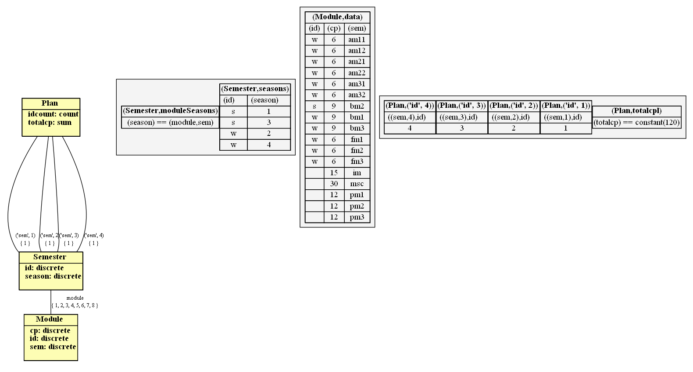

# study-reg-configuration
Modelling the study regulation problem as a configuration problem based on https://github.com/potassco/configuration-encoding

Try it with
```
clingo configuration-encoding/encoding.lp study-regulation-model.lp study-regulation/cogsys.lp --opt-mode=enum 0
```

